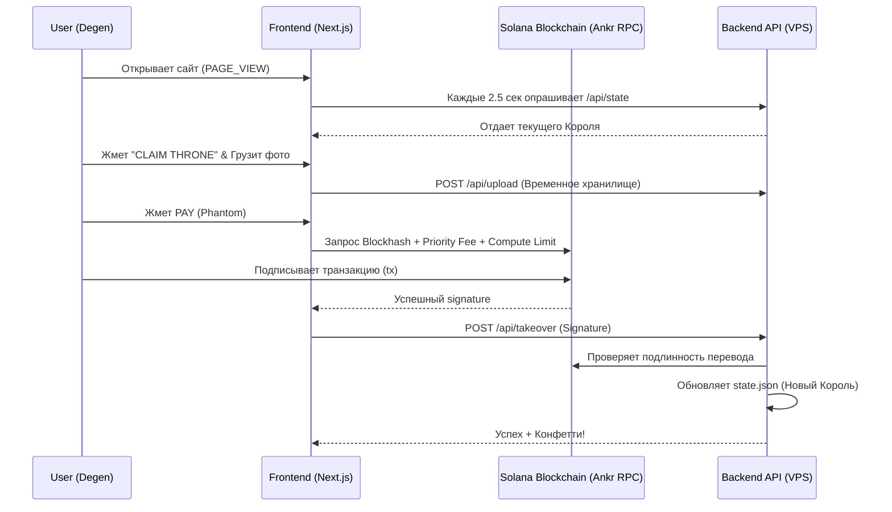

# 👑 King of the Screen: Master Blueprint

  
<strong>DeFi Social Billboard & Viral FOMO Engine</strong>

  
<em>One screen. One ruler. Hold it until you get dethroned.</em>

---

## 🏗️ 1. Архитектура и Пользовательский Опыт (User Flow)

Платформа представляет собой бесконечный аукцион за владение "Главным Экраном". Весь процесс от входа до захвата Трона автоматизирован и синхронизирован у всех зрителей мира.

---

## 💰 2. Токеномика и Сплит-Контракт

Как только транзакция одобряется в Phantom, **Solana** мгновенно расщепляет платеж на две части. Никаких промежуточных пулов — деньги идут сразу на кошельки.

| Доля | Кошелек | Роль | Назначение |
| :--- | :--- | :--- | :--- |
| **80%** | `Ekgf...` (Cold) | **Treasury (Казна)** | Ваша чистая прибыль. Неприкасаемый фонд. |
| **20%** | `AahU...` (Hot) | **Liquidity (Памп)** | Операционные деньги для выкупа $KOTS на рынке. |

> [!TIP]
> **Heavy-Duty Blockchain Settings:**
> Чтобы сеть Solana не "жевала" транзакции при перегрузке, мы используем **Ankr RPC**, завышенный **Priority Fee (1,000,000 microLamports)** и жесткий **Compute Unit Limit (50,000)**. Валидаторы забирают наши переводы первыми.

---

## 🚀 3. Механика Вечного Пампа (The Meta)

Проект использует психологию FOMO (Fear Of Missing Out) и жадность крипто-трейдеров для создания замкнутого цикла роста.

1. **Захват:** Деген покупает экран за $SOL.
2. **Сирена:** В вашей Админке (`/admin`) мигает красная карточка с задачей на откуп.
3. **Откуп (Manual Pump):** Вы берете 20% от его платежа и идете на Pump.fun. Покупаете `$KOTS` по рынку. Образуется **зеленая свеча**.
4. **Эйрдроп:** Купленные монеты вы отправляете самому же покупателю.
5. **Цепная реакция:** Покупатель рад (он получил рекламу + токены). Трейдеры на Pump.fun видят зеленую свечу и приходят на сайт. Они понимают, что покупка экрана пампит токен, и начинают покупать экран, чтобы запампить *свои же вложения*.

---

## 🤖 4. Теневые Роботы (Автоматизация)

Пока вы занимаетесь маркетингом и ручным откупом (для контроля графиков), система выполняет рутину:

*   **Sentinel Bot (`airdrop_sentinel.js`):**
    Крутится в фоне (PM2). Как только появляется новый Король, бот автоматически связывается с контрактом Metaplex и минтит (чеканит) **эксклюзивную Genesis NFT (1 of 100)** прямо на кошелек покупателя. Это исторический артефакт, подтверждающий, что он владел экраном за миллион долларов.
*   **Live Telemetry Engine:**
    Невидимый скрипт на фронтенде отслеживает всё. Сбой кошелька? Закрытие окна? Успешный клик? Все пинги летят в `telemetry.jsonl` и формируют ваш "Радар онлайна".

---

## 🎛️ 5. Ваш Командный Центр (Admin Dashboard)

Доступен по адресу `/admin`. Защищен вашим мастер-паролем. Состояние сохраняется локально (localStorage), поэтому при обновлении страницы пароль вводить не нужно.

*   📡 **Live Viewers:** Показывает, сколько устройств прямо сейчас держат вкладку открытой.
*   🛑 **Airdrop Queue:** Красные карточки. Список транзакций, где вам нужно откупить токен. После выполнения вы жмете "Mark Done", и карточка уходит в историю.
*   ✈️ **Flight Recorder:** Черный ящик. Прямой эфир всех событий (включая ошибки `block height exceeded`, если вдруг Solana упадет целиком).
*   🗑️ **Clear Logs:** Кнопка мгновенной очистки радара.

---

## 🔐 6. Безопасность и Портативность

> [!IMPORTANT]
> Проект на 100% независим от сервера. Вся логика, компоненты и верстка хранятся в **GitHub**.
> Если текущий сервер будет уничтожен, вы сможете восстановить проект на любой другой машине за 10 минут командой `npm run build`.

**Что не хранится в GitHub (Защищено):**
*   Файл `hot_wallet.json` (содержит приватный ключ для Sentinel бота). Хранится **только** в защищенной директории на VPS.
*   Базы данных (`state.json`, `active_users.json`). Они живут своей жизнью на сервере и формируются на лету.
